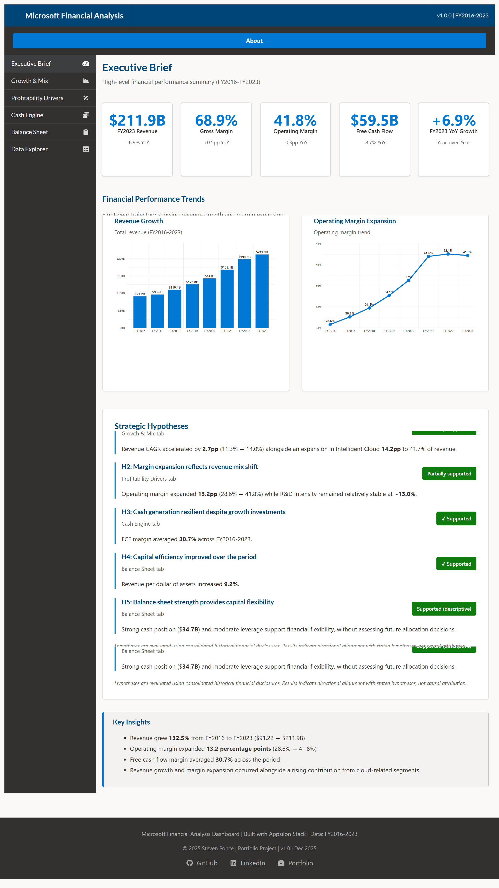
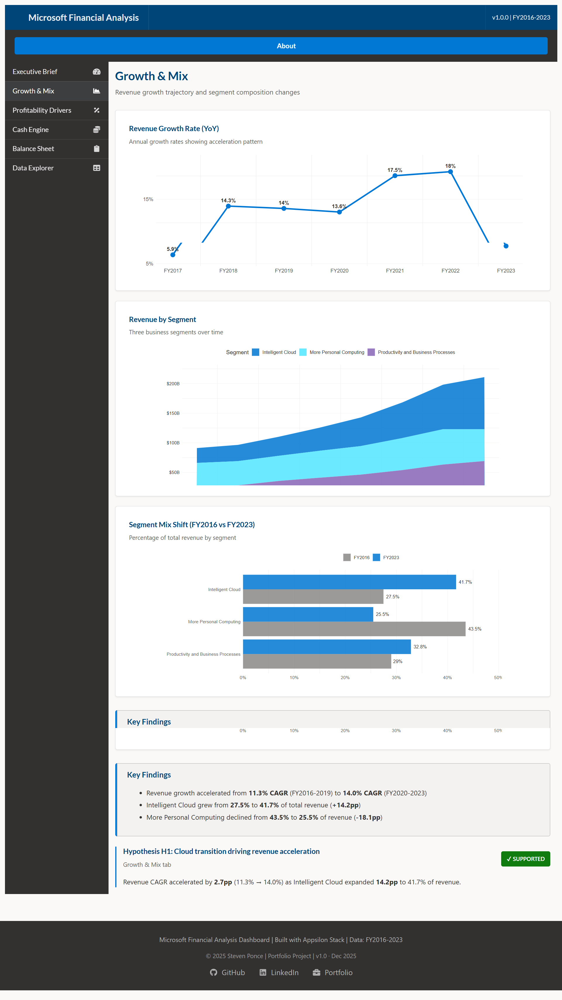
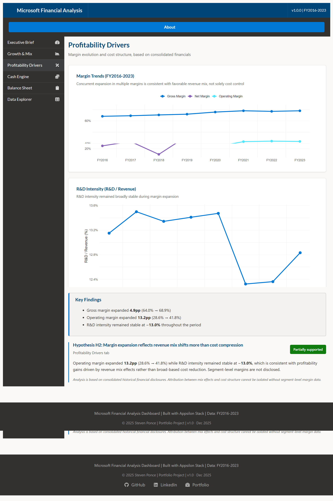

# Microsoft Financial Analysis Dashboard

*A portfolio case study in executive-level financial analysis and decision-support design*

------------------------------------------------------------------------

## Overview

This project presents an independent financial analysis of **Microsoft Corporation** using publicly available, audited disclosures.\
The dashboard is designed as a **decision-support artifact**, emphasizing analytical structure, hypothesis testing, and transparency over prediction or valuation.

The intent is to demonstrate how historical financial data can be translated into **executive-relevant insights** while maintaining strict discipline around scope, assumptions, and evidentiary limits.

This project is **not** an official Microsoft product and is not affiliated with Microsoft Corporation.

------------------------------------------------------------------------

## Live Dashboard

🔗 **Interactive dashboard (ShinyApps.io):**\
<https://0l6jpd-steven-ponce.shinyapps.io/Microsoft_financial_app/>

------------------------------------------------------------------------

## Executive Questions Addressed

## Dashboard Preview

Below are selected views from the dashboard illustrating the analytical structure and executive framing.

### Executive Brief

### Growth & Mix

### Profitability Drivers

*Additional tabs (Cash Engine, Balance Sheet & Capital, Data Explorer) extend this analysis and emphasize transparency and defensibility.*

The dashboard is structured around leadership-level questions commonly faced by executive and finance teams:

-   Where has revenue growth originated over time, and how has the business mix evolved?
-   How have profitability and cash generation changed across business cycles?
-   What does the balance sheet reveal about financial flexibility?
-   Which observed trends are stable, and which require caution due to aggregation limits?

Each section of the dashboard aligns to one or more of these questions.

------------------------------------------------------------------------

## Scope of Analysis

### In Scope

-   Fiscal years **FY2016–FY2023**
-   Consolidated income statement, balance sheet, and cash flow data
-   Revenue growth, margin trends, cash generation, and capital efficiency ratios
-   Segment **revenue-only** disclosures where available

### Out of Scope

-   Stock price performance or shareholder returns
-   Valuation (DCF, multiples, target prices)
-   Forward guidance or forecasts
-   Segment-level margin estimation
-   Management intent or future strategic decisions

The analysis focuses on **historical structure and trends**, not forward-looking performance.

------------------------------------------------------------------------

## Analytical Hypotheses

The dashboard evaluates a set of exploratory, testable hypotheses using reported historical data:

-   **H1:** Revenue growth accelerated in later years, coinciding with shifts in business mix.
-   **H2:** Margin expansion reflects revenue mix effects more than broad-based cost compression.
-   **H3:** Cash generation remained resilient while the company invested in growth.
-   **H4:** Capital efficiency improved over the analysis period.
-   **H5:** Balance sheet strength indicates financial flexibility.

Hypotheses are evaluated using descriptive evidence and are labeled as *supported*, *partially supported*, or *directionally supported* based on available data.

------------------------------------------------------------------------

## Methodology

### Data Sources

-   SEC EDGAR **Company Facts XBRL API** (official SEC-hosted structured data)
-   Microsoft Form 10-K filings (FY2016–FY2023)

### Data Preparation

-   Extracted reported US-GAAP line items from SEC XBRL concepts
-   Normalized figures to USD billions where appropriate
-   Simplified and re-aggregated line items for comparability across years
-   Derived ratios (margins, efficiency metrics) from reported values

Minor rounding differences may occur due to normalization.

### Metric Definitions

-   **Operating Margin:** Operating income ÷ Revenue
-   **Free Cash Flow (proxy):** Operating cash flow − Capital expenditures\
    *(simplified proxy for analytical purposes only)*
-   **Capital Efficiency:** Revenue ÷ Total assets

All metrics are traceable to disclosed SEC filing line items.

------------------------------------------------------------------------

## Dashboard Structure

-   **Executive Brief:** Key KPIs and directional insights
-   **Growth & Mix:** Revenue trends and growth comparisons
-   **Profitability Drivers:** Margin evolution and cost structure context
-   **Cash Engine:** Operating cash flow and free cash flow trends
-   **Balance Sheet & Capital:** Asset composition and financial flexibility
-   **Data Explorer:** Full dataset with export capability and methodology notes

Each section includes concise framing to distinguish observation from interpretation.

------------------------------------------------------------------------

## Design Principles

-   **Hypothesis-first structure:** Questions precede charts
-   **No causal overreach:** Observations are descriptive unless explicitly tested
-   **Transparency:** All calculations and definitions are documented
-   **Executive restraint:** Focus on signal, not exhaustiveness

------------------------------------------------------------------------

## Purpose, Scope, and Disclaimer

### Purpose

This dashboard is an independent analytical exercise created for portfolio and educational purposes only. It is designed to demonstrate financial analysis, hypothesis testing, and executive-level framing using publicly available data.

### Analytical scope

The analysis relies on consolidated historical financial disclosures and is descriptive in nature. Hypotheses are evaluated for **directional alignment**, not causal attribution.

Figures are simplified and normalized for analytical clarity and comparability. This work does not include valuation analysis, forecasts, or forward-looking judgments.

### Independence and use

This project is **not affiliated with, endorsed by, or produced by Microsoft Corporation**.

All data are derived from publicly available SEC filings. No representation is made regarding accuracy beyond the source disclosures.

This dashboard does not constitute investment advice, valuation guidance, or financial recommendations.

------------------------------------------------------------------------

## Technical Stack

-   **Language:** R
-   **Framework:** Shiny (modular architecture)
-   **Visualization:** ggplot2, reactable
-   **Data Handling:** tidyverse, jsonlite
-   **Deployment:** ShinyApps.io

------------------------------------------------------------------------

## License

This project is released under the **MIT License**.

## References

Detailed source links and filing references are maintained in `references.md`.

------------------------------------------------------------------------

Prepared by Steven Ponce as part of a professional analytics portfolio.
